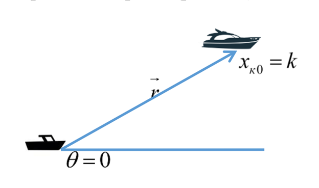
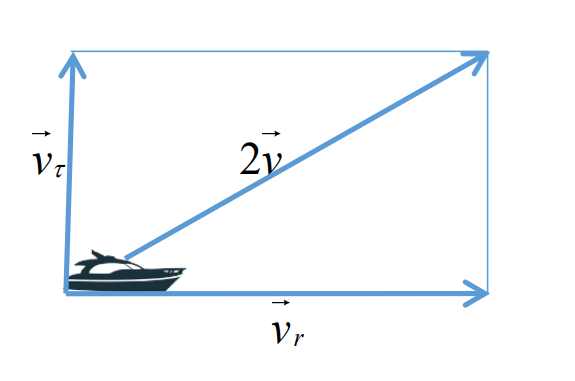
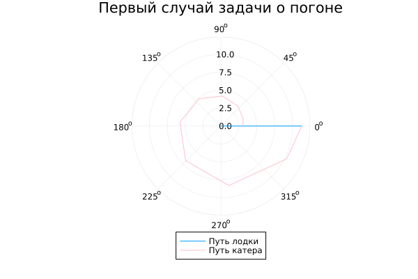
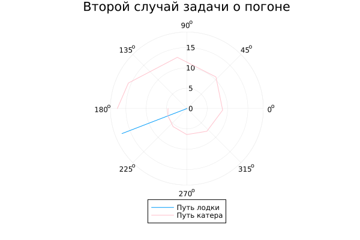

---
## Front matter
lang: ru-RU
title: Лабораторная работа №2
subtitle: Математическое моделирование
author:
  - Гайсина А. Р.
institute:
  - Российский университет дружбы народов, Москва, Россия
date: 20 апреля 2024

## i18n babel
babel-lang: russian
babel-otherlangs: english

## Formatting pdf
toc: false
toc-title: Содержание
slide_level: 2
aspectratio: 169
section-titles: true
theme: metropolis
header-includes:
 - \metroset{progressbar=frametitle,sectionpage=progressbar,numbering=fraction}
 - '\makeatletter'
 - '\beamer@ignorenonframefalse'
 - '\makeatother'
---

# Информация

## Докладчик

:::::::::::::: {.columns align=center}
::: {.column width="70%"}

  * Гайсина Алина Ринатовна
  * Студентка группы НКНбд-01-21
  * Студ. билет 1032216464
  * Российский университет дружбы народов

:::
::: {.column width="30%"}


:::
::::::::::::::


## Цели

Изучить основы языка программирования Julia: библиотеки языка, которые используются для построения графиков и решения дифференциальных уравнений. Решить задачу о погоне. 


## Вводная часть

**Справка о языках программирования:**

Julia — высокоуровневый высокопроизводительный свободный язык программирования с динамической типизацией, созданный для математических вычислений. Эффективен также и для написания программ общего назначения. Синтаксис языка схож с синтаксисом других математических языков (например, MATLAB и Octave), однако имеет некоторые существенные отличия. Julia написан на Си, C++ и Scheme. Имеет встроенную поддержку многопоточности и распределённых вычислений, реализованные в том числе в стандартных конструкциях.

## Задание

На море в тумане катер береговой охраны преследует лодку браконьеров. Через определенный промежуток времени туман рассеивается, и лодка обнаруживается на расстоянии 18 км от катера. Затем лодка снова скрывается в тумане и уходит прямолинейно в неизвестном направлении. Известно, что скорость катера в 4,9 раза больше скорости браконьерской лодки.

## Задачи:

1. Записать уравнение, описывающее движение катера, с начальными условиями для двух случаев (в зависимости от расположения катера относительно лодки в начальный момент времени).
2. Построить траекторию движения катера и лодки для двух случаев.
3. Найти точку пересечения траектории катера и лодки


# Выполнение лабораторной работы

## Математическая модель
1. Принимаем за $t~0~=0, x~л0~=0$ - место нахождения лодки браконьеров в момент обнаружения, $x~к0~=k$ - место нахождения катера береговой охраны относительно лодки браконьеров в момент обнаружения лодки.
2. Введем полярные координаты. Считаем, что полюс - это точка обнаружения лодки браконьеров, а полярная ось _r_ проходит через точку нахождения катера береговой охраны (Рис. [-@fig:001])
    {#fig:001 width=70%}

## Математическая модель
3. Траектория катера должна быть такой, чтобы и катер, и лодка все время были на одном расстоянии от полюса _tetha_, только в этом случае траектория катера пересечется с траекторией лодки. Поэтому для начала катер береговой охраны должен двигаться некоторое время прямолинейно, пока не окажется на том же расстоянии от полюса, что и лодка браконьеров. После этого катер береговой охраны должен двигаться вокруг полюса удаляясь от него с той же скоростью, что и лодка браконьеров.

## Математическая модель
4. Чтобы найти расстояние _x_ (расстояние после которого катер начнет двигаться вокруг полюса), необходимо составить простое уравнение. Пусть через время _t_ катер и лодка окажутся на одном расстоянии _x_ от полюса. За это время лодка пройдет _x_, а катер $k-x$ (или $k+x$, в зависимости от начального положения катера относительно полюса). Время, за которое они пройдут это расстояние, вычисляется как $frac{x}{v}$ или $frac{k-x}{2v}$ ($frac{x+k}{2v}$ - во втором случае). Так как время одно и то же, то эти величины одинаковы. Тогда неизвестное расстояние _x_ можно найти из одного из следующих уравнений: $frac{x}{v}=frac{k-x}{2v}$ или $frac{x}{v}=frac{x+k}{2v}$. Отсюда мы найдём значения $x~1~=k/3$ и $x~2~=k$, задача решается для этих двух случаев.

## Математическая модель
5. После того, как катер береговой охраны окажется на одном расстоянии от полюса, что и лодка, он должен сменить прямолинейную траекторию и начать двигаться вокруг полюса удаляясь от него со скоростью лодки _v_. Для этого скорость катера раскладываем на две составляющие:радиальная скорость и тангенциальная скорость (Рис. [-@fig:002]).
    {#fig:002 width=70%}
  $v~t~=r(frac{d(tetha)}{dt})=sqrt(3)v$.

## Математическая модель
6. Решение исходной задачи сводится к решению системы из двух дифференциальных уравнений:
  $$
  \begin{cases}
	  \frac{dr}{dt}=v  
	  \r(frac{d(tetha)}{dt})=sqrt(3)v
  \end{cases}
  $$.
Проводя аналогичные рассуждения необходимо решить задачу о погоне для своего варианта (Вариант №35).


## Решение с помощью программ
### Julia
Решить дифференциальное уравнение, расписанное в постановке задачи лабораторной работы, поможет библиотека DifferentialEquations. Итоговые изображения в полярных координатах будут строиться через библиотеку Plots. [1]

## Программный код на Julia
```
using DifferentialEquations
using Plots

k = 18
n = 4.9
function dr(u, p, t)
    return u/sqrt(n*n - 1)
end 
```

## Программный код на Julia
```
# Первый случай
r0 = k/(n + 1)
tetha = (0, 2*pi)

prob = ODEProblem(dr, r0, tetha)
sol = solve(prob, abstol = 1e-8, reltol = 1e-8)
r_ang = [sol.t[rand(1:size(sol.t)[1])] for i in 1:size(sol.t)[1]]
```

## Программный код на Julia
```
plt = plot(proj=:polar, aspect_ratio=:equal, title="Первый случай задачи о погоне", legend=:outerbottom)
plot!(plt, [r_ang[1], r_ang[2]], [0.0, sol.u[size(sol.u)[1]]], label="Путь лодки")
plot!(plt, sol.t, sol.u, label="Путь катера", color=:pink)
savefig("2_1.png")
```

## Программный код на Julia
```
# Второй случай
r0 = k/(n - 1)
tetha = (-pi, pi)

prob = ODEProblem(dr, r0, tetha)
sol = solve(prob, abstol=1e-8, reltol=1e-8)
r_ang = [sol.t[rand(1:size(sol.t)[1])] for i in 1:size(sol.t)[1]]
```

## Программный код на Julia
```
plt = plot(proj=:polar, aspect_ratio=:equal, title="Второй случай задачи о погоне", legend=:outerbottom)
plot!(plt, [r_ang[1], r_ang[2]], [0.0, sol.u[size(sol.u)[1]]], label="Путь лодки")
plot!(plt, sol.t, sol.u, label="Путь катера", color=:pink)
savefig("2_2.png")
```

## Результат работы программы
Построила траекторию движения катера и лодки для первого случая (Рис. [-@fig:003]).
{#fig:003 width=70%}

## Результат работы программы
Построила траекторию движения катера и лодки для второго случая (Рис. [-@fig:004]).
{#fig:004 width=70%}

# Анализ полученных результатов
При помощи языка программирования Julia я построила графики решения задачи о погоне для двух случаев. Изучая графики можно узнать примерные точки пересечения катера береговой охраны и лодки браконьеров.


# Вывод
Были изучены основы языка программирования Julia. Решена задача о погоне.

# Список литературы. Библиография
[1] Документация по Julia: https://docs.julialang.org/en/v1/
[2] Решение дифференциальных уравнений: https://www.wolframalpha.com/