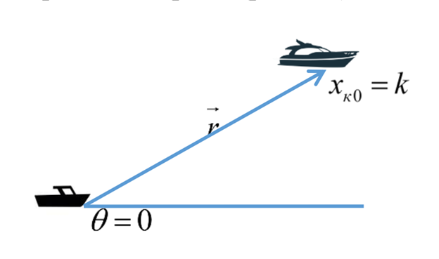
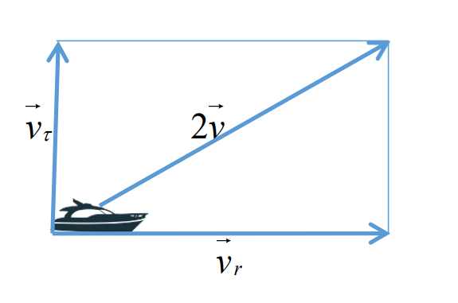
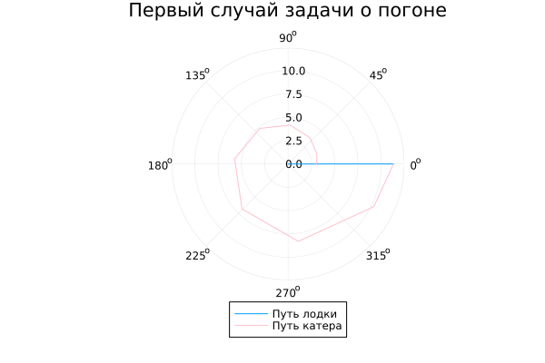

---
## Front matter
title: "Отчёт по лабораторной работе №2"
subtitle: "Задача о погоне"
author: "Гайсина Алина Ринатовна"

## Generic otions
lang: ru-RU
toc-title: "Содержание"

## Bibliography
bibliography: bib/cite.bib
csl: pandoc/csl/gost-r-7-0-5-2008-numeric.csl

## Pdf output format
toc: true # Table of contents
toc-depth: 2
lof: true # List of figures
lot: true # List of tables
fontsize: 12pt
linestretch: 1.5
papersize: a4
documentclass: scrreprt
## I18n polyglossia
polyglossia-lang:
  name: russian
  options:
	- spelling=modern
	- babelshorthands=true
polyglossia-otherlangs:
  name: english
## I18n babel
babel-lang: russian
babel-otherlangs: english
## Fonts
mainfont: PT Serif
romanfont: PT Serif
sansfont: PT Sans
monofont: PT Mono
mainfontoptions: Ligatures=TeX
romanfontoptions: Ligatures=TeX
sansfontoptions: Ligatures=TeX,Scale=MatchLowercase
monofontoptions: Scale=MatchLowercase,Scale=0.9
## Biblatex
biblatex: true
biblio-style: "gost-numeric"
biblatexoptions:
  - parentracker=true
  - backend=biber
  - hyperref=auto
  - language=auto
  - autolang=other*
  - citestyle=gost-numeric
## Pandoc-crossref LaTeX customization
figureTitle: "Рис."
tableTitle: "Таблица"
listingTitle: "Листинг"
lofTitle: "Список иллюстраций"
lotTitle: "Список таблиц"
lolTitle: "Листинги"
## Misc options
indent: true
header-includes:
  - \usepackage{indentfirst}
  - \usepackage{float} # keep figures where there are in the text
  - \floatplacement{figure}{H} # keep figures where there are in the text
---

# Цель работы
Изучить основы языка программирования Julia: библиотеки языка, которые используются для построения графиков и решения дифференциальных уравнений. Решить задачу о погоне. 

# Задание (Вариант№35)
На море в тумане катер береговой охраны преследует лодку браконьеров. Через определенный промежуток времени туман рассеивается, и лодка обнаруживается на расстоянии 18 км от катера. Затем лодка снова скрывается в тумане и уходит прямолинейно в неизвестном направлении. Известно, что скорость катера в 4,9 раза больше скорости браконьерской лодки.
## Постановка задачи
1. Запишите уравнение, описывающее движение катера, с начальными условиями для двух случаев (в зависимости от расположения катера относительно лодки в начальный момент времени).
2. Постройте траекторию движения катера и лодки для двух случаев.
3. Найдите точку пересечения траектории катера и лодки.

# Теоретическое введение
1. Принимаем за $t~0~=0, x~л0~=0$ - место нахождения лодки браконьеров в момент обнаружения, $x~к0~=k$ - место нахождения катера береговой охраны относительно лодки браконьеров в момент обнаружения лодки.
2. Введем полярные координаты. Считаем, что полюс - это точка обнаружения лодки браконьеров, а полярная ось _r_ проходит через точку нахождения катера береговой охраны (Рис. [-@fig:001])
    {#fig:001 width=70%}
3. Траектория катера должна быть такой, чтобы и катер, и лодка все время были на одном расстоянии от полюса _tetha_, только в этом случае траектория катера пересечется с траекторией лодки. Поэтому для начала катер береговой охраны должен двигаться некоторое время прямолинейно, пока не окажется на том же расстоянии от полюса, что и лодка браконьеров. После этого катер береговой охраны должен двигаться вокруг полюса удаляясь от него с той же скоростью, что и лодка браконьеров.
4. Чтобы найти расстояние _x_ (расстояние после которого катер начнет двигаться вокруг полюса), необходимо составить простое уравнение. Пусть через время _t_ катер и лодка окажутся на одном расстоянии _x_ от полюса. За это время лодка пройдет _x_, а катер $k-x$ (или $k+x$, в зависимости от начального положения катера относительно полюса). Время, за которое они пройдут это расстояние, вычисляется как $frac{x}{v}$ или $frac{k-x}{2v}$ ($frac{x+k}{2v}$ - во втором случае). Так как время одно и то же, то эти величины одинаковы. Тогда неизвестное расстояние _x_ можно найти из одного из следующих уравнений: $frac{x}{v}=frac{k-x}{2v}$ или $frac{x}{v}=frac{x+k}{2v}$. Отсюда мы найдём значения $x~1~=k/3$ и $x~2~=k$, задача решается для этих двух случаев.
5. После того, как катер береговой охраны окажется на одном расстоянии от полюса, что и лодка, он должен сменить прямолинейную траекторию и начать двигаться вокруг полюса удаляясь от него со скоростью лодки _v_. Для этого скорость катера раскладываем на две составляющие:радиальная скорость и тангенциальная скорость (Рис. [-@fig:002]).
    {#fig:002 width=70%}
  $v~t~=r(frac{d(tetha)}{dt})=sqrt(3)v$.
6. Решение исходной задачи сводится к решению системы из двух дифференциальных уравнений:
  $$
  \begin{cases}
	  \frac{dr}{dt}=v  
	  \r(frac{d(tetha)}{dt})=sqrt(3)v
  \end{cases}
  $$.
Проводя аналогичные рассуждения необходимо решить задачу о погоне для своего варианта (Вариант №35).


# Выполнение лабораторной работы
## Программный код на Julia.
```
using DifferentialEquations
using Plots

k = 18
n = 4.9
function dr(u, p, t)
    return u/sqrt(n*n - 1)
end 

# Первый случай
r0 = k/(n + 1)
tetha = (0, 2*pi)

prob = ODEProblem(dr, r0, tetha)
sol = solve(prob, abstol = 1e-8, reltol = 1e-8)

r_ang = [sol.t[rand(1:size(sol.t)[1])] for i in 1:size(sol.t)[1]]

plt = plot(proj=:polar, aspect_ratio=:equal, title="Первый случай задачи о погоне", legend=:outerbottom)
plot!(plt, [r_ang[1], r_ang[2]], [0.0, sol.u[size(sol.u)[1]]], label="Путь лодки")
plot!(plt, sol.t, sol.u, label="Путь катера", color=:pink)
savefig("2_1.png")

# Второй случай
r0 = k/(n - 1)
tetha = (-pi, pi)

prob = ODEProblem(dr, r0, tetha)
sol = solve(prob, abstol=1e-8, reltol=1e-8)
r_ang = [sol.t[rand(1:size(sol.t)[1])] for i in 1:size(sol.t)[1]]

plt = plot(proj=:polar, aspect_ratio=:equal, title="Второй случай задачи о погоне", legend=:outerbottom)
plot!(plt, [r_ang[1], r_ang[2]], [0.0, sol.u[size(sol.u)[1]]], label="Путь лодки")
plot!(plt, sol.t, sol.u, label="Путь катера", color=:pink)
savefig("2_2.png")
```
## Результат выполнения программы
1.  Построила траекторию движения катера и лодки для первого случая (Рис. [-@fig:003]).
{#fig:003 width=70%}

2. Построила траекторию движения катера и лодки для второго случая (Рис. [-@fig:004]).
{#fig:004 width=70%}

# Выводы
Были изучены основы языка программирования Julia. Решена задача о погоне.

# Список литературы. Библиография
[1] Документация по Julia: https://docs.julialang.org/en/v1/
[2] Решение дифференциальных уравнений: https://www.wolframalpha.com/