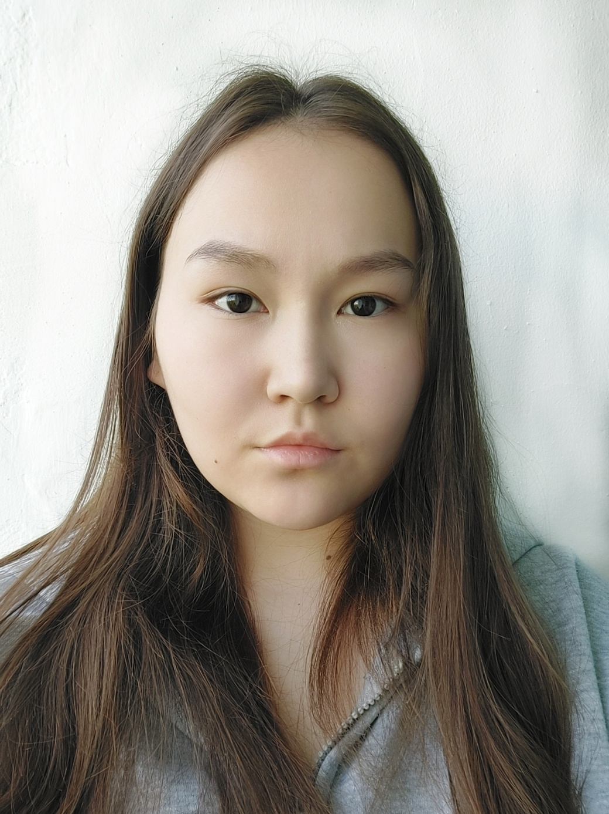
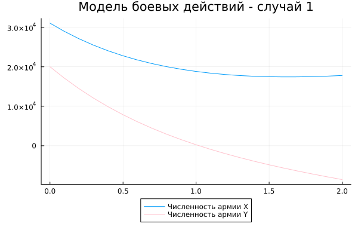
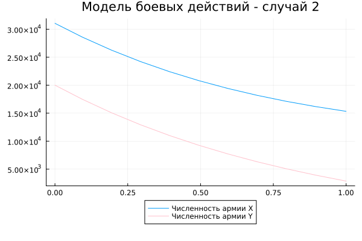

---
## Front matter
lang: ru-RU
title: Лабораторная работа №3
subtitle: Математическое моделирование
author:
  - Гайсина А. Р.
institute:
  - Российский университет дружбы народов, Москва, Россия
date: 20 апреля 2024

## i18n babel
babel-lang: russian
babel-otherlangs: english

## Formatting pdf
toc: false
toc-title: Содержание
slide_level: 2
aspectratio: 169
section-titles: true
theme: metropolis
header-includes:
 - \metroset{progressbar=frametitle,sectionpage=progressbar,numbering=fraction}
 - '\makeatletter'
 - '\beamer@ignorenonframefalse'
 - '\makeatother'
---

# Информация

## Докладчик

:::::::::::::: {.columns align=center}
::: {.column width="70%"}

  * Гайсина Алина Ринатовна
  * Студентка группы НКНбд-01-21
  * Студ. билет 1032216464
  * Российский университет дружбы народов

:::
::: {.column width="30%"}



:::
::::::::::::::


## Цели
Изучение модели боевых действий.

# Вводная часть
**Справка о языках программирования:**
Julia — высокоуровневый высокопроизводительный свободный язык программирования с динамической типизацией, созданный для математических вычислений. Эффективен также и для написания программ общего назначения. Синтаксис языка схож с синтаксисом других математических языков (например, MATLAB и Octave), однако имеет некоторые существенные отличия. Julia написан на Си, C++ и Scheme. Имеет встроенную поддержку многопоточности и распределённых вычислений, реализованные в том числе в стандартных конструкциях. [1]

## Теоретическое введение
Законы Ланчестера (законы Осипова — Ланчестера) — математическая формула для расчета относительных сил пары сражающихся сторон — подразделений вооруженных сил

*Уравнения Ланчестера — это дифференциальные уравнения, описывающие зависимость между силами сражающихся сторон A и D как функцию от времени, причем функция зависит только от A и D.*

В 1916 году, в разгар первой мировой войны, Фредерик Ланчестер разработал систему дифференциальных уравнений для демонстрации соотношения между противостоящими силами. Среди них есть так называемые Линейные законы Ланчестера (первого рода или честного боя, для рукопашного боя или неприцельного огня) и Квадратичные законы Ланчестера (для войн начиная с XX века с применением прицельного огня, дальнобойных орудий, огнестрельного оружия). В связи с установленным приоритетом в англоязычной литературе наметилась тенденция перехода от фразы «модель Ланчестера» к «модели Осипова — Ланчестера».

## Теоретическое введение
- В противоборстве могут принимать участие как регулярные войска,
так и партизанские отряды. В общем случае главной характеристикой соперников
являются численности сторон. Если в какой-то момент времени одна из
численностей обращается в нуль, то данная сторона считается проигравшей (при
условии, что численность другой стороны в данный момент положительна).

Рассмотривается три случая ведения боевых действий:
1. Боевые действия между регулярными войсками
2. Боевые действия с участием регулярных войск и партизанских отрядов
3. Боевые действия между партизанскими отрядами

# Задание (Вариант№35)
Между страной _Х_ и страной _У_ идет война. Численность состава войск исчисляется от начала войны, и являются временными функциями _x(t)_ и _y(t)_. В начальный момент времени страна _Х_ имеет армию численностью **31050** человек, а в распоряжении страны _У_ армия численностью в **20002** человек. Для упрощения модели считаем, что коэффициенты _a_, _b_, _c_, _h_ -  постоянны. Также считаем _P(t)_ и _Q(t)_ - непрерывные функции.

## Постановка задачи
Постройте графики изменения численности войск армии _Х_ и армии _У_ для следующих случаев:  
1. Модель боевых действий между регулярными войсками:
  $$
  \begin{cases}
	  \frac{dx}{dt}=-0.25x(t)-0.74y(t)+sin(t+5)
	  \\
	  \frac{dy}{dt}=-0.64x(t)-0.55y(t)+cos(t+6)
  \end{cases}
  $$.
2. Модель ведение боевых действий с участием регулярных войск и партизанских отрядов:
  $$
  \begin{cases}
	  \frac{dx}{dt}=-0.32x(t)-0.89y(t)+2sin(10t)
	  \\
	  \frac{dy}{dt}=-0.51x(t)-0.62y(t)+2cos(10t)
  \end{cases}
  $$.


# Выполнение лабораторной работы
## Программный код на Julia
```
using Plots
using DifferentialEquations

people = Float64[31050, 20002]

# Первый случай
prom = [0.0, 2.0]
function du(du, u, p, t)
    du[1] = -0.25*u[1] - 0.74*u[2] + sin(t+5)
    du[2] = -0.64*u[1] - 0.55*u[2] + cos(t+6)
end
```
## Программный код на Julia
```
prob = ODEProblem(du, people, prom)
sol = solve(prob, dtmax=0.1)
A1 = [u[1] for u in sol.u]
A2 = [u[2] for u in sol.u]
T = [t for t in sol.t]

plt = plot(title="Модель боевых действий - случай 1", legend=:outerbottom)
plot!(plt, T, A1, label="Численность армии X")
plot!(plt, T, A2, label="Численность армии Y", color=:pink)
savefig("3_1.png")
```
## Программный код на Julia
```
# Второй случай
prom = [0.0, 1.0]
function du(du, u, p, t)
    du[1] = -0.32*u[1] - 0.89*u[2] + 2sin(10t)
    du[2] = -0.51*u[1] - 0.62*u[2] + 2cos(10t)
end

prob = ODEProblem(du, people, prom)
sol = solve(prob, dtmax=0.1)
A1 = [u[1] for u in sol.u]
A2 = [u[2] for u in sol.u]
T = [t for t in sol.t]

plt = plot(title="Модель боевых действий - случай 2", legend=:outerbottom)
plot!(plt, T, A1, label="Численность армии X")
plot!(plt, T, A2, label="Численность армии Y", color=:pink)
savefig("3_2.png")
```
## Результат выполнения программы Julia
{#fig:001 width=70%}

## Результат выполнения программы Julia
{#fig:002 width=70%}

## Программный код на OpenModelica
```
Real y11(start=31050);
Real y21(start=20002);
parameter Real a = 0.25;
parameter Real b = 0.74;
parameter Real c = 0.64;
parameter Real d = 0.55;
```
## Программный код на OpenModelica
```
Real y12(start=31050);
Real y22(start=20002);
parameter Real a2 = 0.32;
parameter Real b2 = 0.89;
parameter Real c2 = 0.51;
parameter Real d2 = 0.55;
```
## Программный код на OpenModelica
```
equation
  der(y11) = -a*y11 - b*y21 + sin(time+5);
  der(y21) = -c*y11 - d*y21 + cos(time+6);
  
equation
  der(y12) = -a2*y12 - b2*y22 + 2*sin(10*time);
  der(y22) = -c2*y12*y22 - d2*y22 + 2*cos(10*time);
```

## Анализ полученных результатов
При помощи языков программирования Julia и OpenModelica я построила 2 модели боевых действий.

## Вывод
При помощи языков программирования Julia и OpenModelica я построила 2 модели боевых действий.

## Список литературы. Библиография
[1] Документация по Julia: https://docs.julialang.org/en/v1/
[2] Решение дифференциальных уравнений: https://www.wolframalpha.com/
