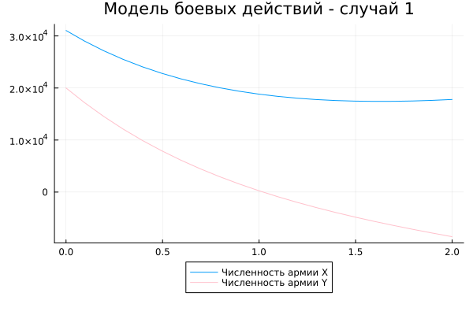
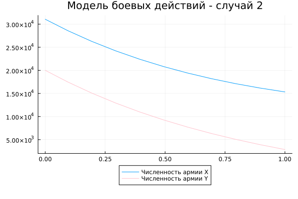

---
## Front matter
title: "Отчёт по лабораторной работе №3"
subtitle: "Модель боевых действий"
author: "Гайсина Алина Ринатовна"

## Generic otions
lang: ru-RU
toc-title: "Содержание"

## Bibliography
bibliography: bib/cite.bib
csl: pandoc/csl/gost-r-7-0-5-2008-numeric.csl

## Pdf output format
toc: true # Table of contents
toc-depth: 2
lof: true # List of figures
lot: true # List of tables
fontsize: 12pt
linestretch: 1.5
papersize: a4
documentclass: scrreprt
## I18n polyglossia
polyglossia-lang:
  name: russian
  options:
	- spelling=modern
	- babelshorthands=true
polyglossia-otherlangs:
  name: english
## I18n babel
babel-lang: russian
babel-otherlangs: english
## Fonts
mainfont: PT Serif
romanfont: PT Serif
sansfont: PT Sans
monofont: PT Mono
mainfontoptions: Ligatures=TeX
romanfontoptions: Ligatures=TeX
sansfontoptions: Ligatures=TeX,Scale=MatchLowercase
monofontoptions: Scale=MatchLowercase,Scale=0.9
## Biblatex
biblatex: true
biblio-style: "gost-numeric"
biblatexoptions:
  - parentracker=true
  - backend=biber
  - hyperref=auto
  - language=auto
  - autolang=other*
  - citestyle=gost-numeric
## Pandoc-crossref LaTeX customization
figureTitle: "Рис."
tableTitle: "Таблица"
listingTitle: "Листинг"
lofTitle: "Список иллюстраций"
lotTitle: "Список таблиц"
lolTitle: "Листинги"
## Misc options
indent: true
header-includes:
  - \usepackage{indentfirst}
  - \usepackage{float} # keep figures where there are in the text
  - \floatplacement{figure}{H} # keep figures where there are in the text
---

# Цель работы
Изучение модели боевых действий.

# Задание (Вариант№35)
Между страной _Х_ и страной _У_ идет война. Численность состава войск исчисляется от начала войны, и являются временными функциями _x(t)_ и _y(t)_. В начальный момент времени страна _Х_ имеет армию численностью **31050** человек, а в распоряжении страны _У_ армия численностью в **20002** человек. Для упрощения модели считаем, что коэффициенты _a_, _b_, _c_, _h_ -  постоянны. Также считаем _P(t)_ и _Q(t)_ - непрерывные функции.
## Постановка задачи
Постройте графики изменения численности войск армии _Х_ и армии _У_ для следующих случаев:
1. Модель боевых действий между регулярными войсками:
  $$
  \begin{cases}
	  \frac{dx}{dt}=-0.25x(t)-0.74y(t)+sin(t+5)
	  \frac{dy}{dt}=-0.64x(t)-0.55y(t)+cos(t+6)
  \end{cases}
  $$.
2. Модель ведение боевых действий с участием регулярных войск и партизанских отрядов:
  $$
  \begin{cases}
	  \frac{dx}{dt}=-0.32x(t)-0.89y(t)+2sin(10t)
	  \frac{dy}{dt}=-0.51x(t)-0.62y(t)+2cos(10t)
  \end{cases}
  $$.

# Теоретическое введение
Законы Ланчестера (законы Осипова — Ланчестера) — математическая формула для расчета относительных сил пары сражающихся сторон — подразделений вооруженных сил

*Уравнения Ланчестера — это дифференциальные уравнения, описывающие зависимость между силами сражающихся сторон A и D как функцию от времени, причем функция зависит только от A и D.*

В 1916 году, в разгар первой мировой войны, Фредерик Ланчестер разработал систему дифференциальных уравнений для демонстрации соотношения между противостоящими силами. Среди них есть так называемые Линейные законы Ланчестера (первого рода или честного боя, для рукопашного боя или неприцельного огня) и Квадратичные законы Ланчестера (для войн начиная с XX века с применением прицельного огня, дальнобойных орудий, огнестрельного оружия). В связи с установленным приоритетом в англоязычной литературе наметилась тенденция перехода от фразы «модель Ланчестера» к «модели Осипова — Ланчестера». [1]

- В противоборстве могут принимать участие как регулярные войска,
так и партизанские отряды. В общем случае главной характеристикой соперников
являются численности сторон. Если в какой-то момент времени одна из
численностей обращается в нуль, то данная сторона считается проигравшей (при
условии, что численность другой стороны в данный момент положительна).

Рассмотривается три случая ведения боевых действий:
1. Боевые действия между регулярными войсками
2. Боевые действия с участием регулярных войск и партизанских отрядов
3. Боевые действия между партизанскими отрядами

# Выполнение лабораторной работы
## Программный код на Julia
```
using Plots
using DifferentialEquations

people = Float64[31050, 20002]

# Первый случай
prom = [0.0, 2.0]
function du(du, u, p, t)
    du[1] = -0.25*u[1] - 0.74*u[2] + sin(t+5)
    du[2] = -0.64*u[1] - 0.55*u[2] + cos(t+6)
end

prob = ODEProblem(du, people, prom)
sol = solve(prob, dtmax=0.1)
A1 = [u[1] for u in sol.u]
A2 = [u[2] for u in sol.u]
T = [t for t in sol.t]

plt = plot(title="Модель боевых действий - случай 1", legend=:outerbottom)
plot!(plt, T, A1, label="Численность армии X")
plot!(plt, T, A2, label="Численность армии Y", color=:pink)
savefig("3_1.png")

# Второй случай
prom = [0.0, 1.0]
function du(du, u, p, t)
    du[1] = -0.32*u[1] - 0.89*u[2] + 2sin(10t)
    du[2] = -0.51*u[1] - 0.62*u[2] + 2cos(10t)
end

prob = ODEProblem(du, people, prom)
sol = solve(prob, dtmax=0.1)
A1 = [u[1] for u in sol.u]
A2 = [u[2] for u in sol.u]
T = [t for t in sol.t]

plt = plot(title="Модель боевых действий - случай 2", legend=:outerbottom)
plot!(plt, T, A1, label="Численность армии X")
plot!(plt, T, A2, label="Численность армии Y", color=:pink)
savefig("3_2.png")
```

## Результат выполнения программы Julia
1.  Построила модель боевых действий между регулярными войсками (Рис. [-@fig:001]).
{#fig:001 width=70%}

2. Построила модель ведения боевых действий с участием регулярных войск и партизанских отрядов (Рис. [-@fig:002]).
{#fig:002 width=70%}

## Программный код на OpenModelica
```
Real y11(start=31050);
Real y21(start=20002);
parameter Real a = 0.25;
parameter Real b = 0.74;
parameter Real c = 0.64;
parameter Real d = 0.55;

Real y12(start=31050);
Real y22(start=20002);
parameter Real a2 = 0.32;
parameter Real b2 = 0.89;
parameter Real c2 = 0.51;
parameter Real d2 = 0.55;

equation
  der(y11) = -a*y11 - b*y21 + sin(time+5);
  der(y21) = -c*y11 - d*y21 + cos(time+6);
  
equation
  der(y12) = -a2*y12 - b2*y22 + 2*sin(10*time);
  der(y22) = -c2*y12*y22 - d2*y22 + 2*cos(10*time);
```

# Анализ полученных результатов
При помощи языков программирования Julia и OpenModelica я построила 2 модели боевых действий.

# Выводы
Была изучена модель боевых действий.

# Список литературы. Библиография
[1] Законы Ланчестера: https://ru.wikipedia.org/wiki/%D0%97%D0%B0%D0%BA%D0%BE%D0%BD%D1%8B_%D0%9E%D1%81%D0%B8%D0%BF%D0%BE%D0%B2%D0%B0_%E2%80%94_%D0%9B%D0%B0%D0%BD%D1%87%D0%B5%D1%81%D1%82%D0%B5%D1%80%D0%B0