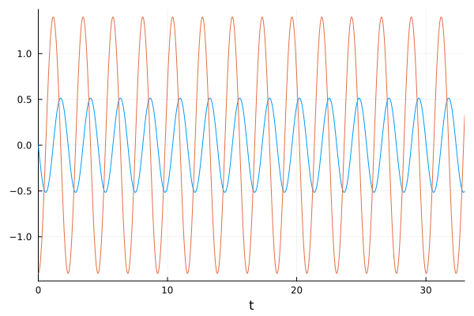
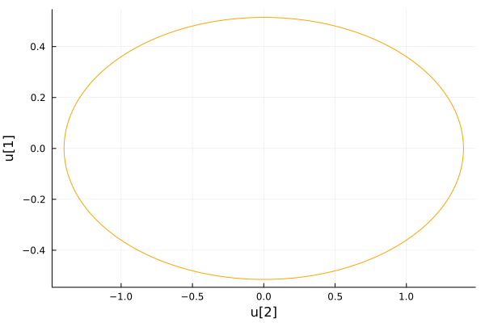
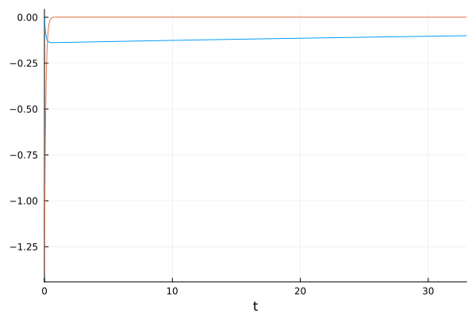
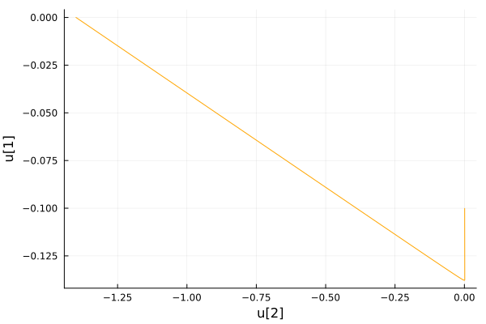
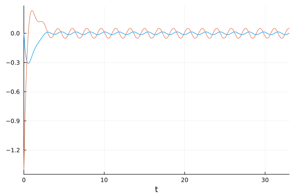
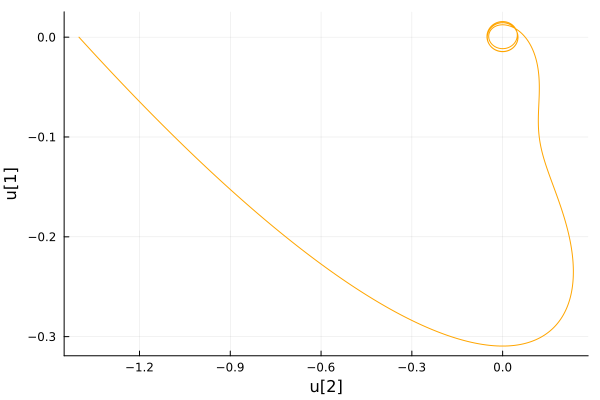

---
## Front matter
lang: ru-RU
title: Лабораторная работа №4
subtitle: Математическое моделирование
author:
  - Гайсина А. Р.
institute:
  - Российский университет дружбы народов, Москва, Россия
date: 20 апреля 2024

## i18n babel
babel-lang: russian
babel-otherlangs: english

## Formatting pdf
toc: false
toc-title: Содержание
slide_level: 2
aspectratio: 169
section-titles: true
theme: metropolis
header-includes:
 - \metroset{progressbar=frametitle,sectionpage=progressbar,numbering=fraction}
 - '\makeatletter'
 - '\beamer@ignorenonframefalse'
 - '\makeatother'
---

# Информация

## Докладчик

:::::::::::::: {.columns align=center}
::: {.column width="70%"}

  * Гайсина Алина Ринатовна
  * Студентка группы НКНбд-01-21
  * Студ. билет 1032216464
  * Российский университет дружбы народов

:::
::: {.column width="30%"}


:::
::::::::::::::


## Цели
Изучение модели гармонических колебаний.


# Вводная часть
**Справка о языках программирования:**
Julia — высокоуровневый высокопроизводительный свободный язык программирования с динамической типизацией, созданный для математических вычислений. Эффективен также и для написания программ общего назначения. Синтаксис языка схож с синтаксисом других математических языков (например, MATLAB и Octave), однако имеет некоторые существенные отличия. Julia написан на Си, C++ и Scheme. Имеет встроенную поддержку многопоточности и распределённых вычислений, реализованные в том числе в стандартных конструкциях.

## Теоретическое введение
Движение грузика на пружинке, маятника, заряда в электрическом контуре, а также эволюция во времени многих систем в физике, химии, биологии и других науках при определенных предположениях можно описать одним и тем же дифференциальным уравнением, которое в теории колебаний выступает в качестве основной модели. Эта модель называется линейным гармоническим осциллятором. 
Уравнение свободных колебаний гармонического осциллятора имеет следующий вид: $\ddot{x} + 2\gamma\dot{x} + \omega_0^2 = 0 (1)$, где _x_ - переменная, описывающая состояние системы, $\gamma$ – параметр, характеризующий потери энергии, $\omega_0$ – собственная частота колебаний, _t_ – время.

## Теоретическое введение
Уравнение (1) есть линейное однородное дифференциальное уравнение второго порядка и оно является примером линейной динамической системы.
При отсутствии потерь в системе ($\gamma=0$) вместо уравнения (1) получаем уравнение консервативного осциллятора энергия колебания которого сохраняется во времени.
$$\ddot{x} + \omega_0^2 = 0 (2)$$.

## Теоретическое введение
Для однозначной разрешимости уравнения второго порядка (2) необходимо задать два начальных условия вида:
    $$
    \begin{cases}
       x(t_0)=x_0  
       \dot{x(t_0)}=y_0
    \end{cases}
    $$
    
## Теоретическое введение
Уравнение второго порядка (2) можно представить в виде системы двух уравнений первого порядка:
    $$
    \begin{cases}
       \dot{x}=y  
       \dot{y}=-\omega_0^2x
    \end{cases}
    $$
Начальные условия для системы примут вид:
$$
 \begin{cases}
	x(t_0)=x_0  
	y(t_0)=y_0
 \end{cases}
$$

## Теоретическое введение
Независимые переменные x, y определяют пространство, в котором «движется» решение. Это фазовое пространство системы, поскольку оно двумерно будем называть его фазовой плоскостью. 
Значение фазовых координат x, y в любой момент времени полностью определяет состояние системы. Решению уравнения движения как функции времени отвечает гладкая кривая в фазовой плоскости. Она называется фазовой траекторией. Если множество различных решений (соответствующих различным начальным условиям) изобразить на одной фазовой плоскости, возникает общая картина поведения системы. Такую картину, образованную набором фазовых траекторий, называют фазовым портретом.

# Задание (Вариант№35)
Постройте фазовый портрет гармонического осциллятора и решение уравнения гармонического осциллятора для следующих случаев:
1. Колебания гармонического осциллятора без затуханий и без действий внешней силы $\ddot{x} + 7.4x = 0$.
2. Колебания гармонического осциллятора c затуханием и без действий внешней силы $\ddot{x} + 10.1\dot{x} + 0.1x = 0$.
3. Колебания гармонического осциллятора c затуханием и под действием внешней силы $\ddot{x} + 3\dot{x} + 3.3x = 0.2sin(3.5t)$.
На интервале $t\in [0; 33]$ (шаг 0.05) с начальными условиями $x_0 = 0, y_0 = -1.4$.

# Выполнение лабораторной работы
## Программный код на Julia
```
using DifferentialEquations
using Plots

# Первый случай
function syst(du, u, p, t)
    a = p
    du[1] = u[2]
    du[2] = -a*u[1]
end

u0 = [0.0, -1.4]
```

## Программный код на Julia
```
p = (7.4)
tspan = (0.0, 33.0)
prob = ODEProblem(syst, u0, tspan, p)
sol = solve(prob, dtmax = 0.05)

#решение системы уравнений
plot(sol, legend=:false)
savefig("4_1_1.png")

#фазовый портрет
plot(sol, vars=(2,1), legend=:false, color=:orange)
savefig("4_1_2.png")
```

## Программный код на Julia
```
# Второй случай
function syst(du, u, p, t)
    a, b = p
    du[1] = u[2]
    du[2] = -a*du[1] - b*u[1]
end

u0 = [0.0, -1.4]

p = (10.1, 0.1)
tspan = (0.0, 33.0)
prob = ODEProblem(syst, u0, tspan, p)
sol = solve(prob, dtmax = 0.05)
```

## Программный код на Julia
```
#решение системы уравнений
plot(sol, legend=:false)
savefig("4_2_1.png")

#фазовый портрет
plot(sol, vars=(2,1), legend=:false, color=:orange)
savefig("4_2_2.png")
```

## Программный код на Julia
```
function syst(du, u, p, t)
    a, b = p
    du[1] = u[2]
    du[2] = -a*du[1] - b*u[1] + 0.2*sin(3.5*t)
end

u0 = [0.0, -1.4]

p = (3.0, 3.3)
tspan = (0.0, 33.0)
prob = ODEProblem(syst, u0, tspan, p)
sol = solve(prob, dtmax = 0.05)
```

## Программный код на Julia
```
#решение системы уравнений
plot(sol, legend=:false)
savefig("4_3_1.png")

#фазовый портрет
plot(sol, vars=(2,1), legend=:false, color=:orange)
savefig("4_3_2.png")
```

## Результат выполнения программы
{#fig:001 width=70%}

## Результат выполнения программы
{#fig:002 width=70%}

## Результат выполнения программы
{#fig:003 width=70%}

## Результат выполнения программы
{#fig:004 width=70%}

## Результат выполнения программы
{#fig:005 width=70%}

## Результат выполнения программы
{#fig:006 width=70%}


## Вывод
Была изучена модель гармонических колебаний.

## Список литературы. Библиография
[1] Документация по Julia: https://docs.julialang.org/en/v1/
[2] Решение дифференциальных уравнений: https://www.wolframalpha.com/
