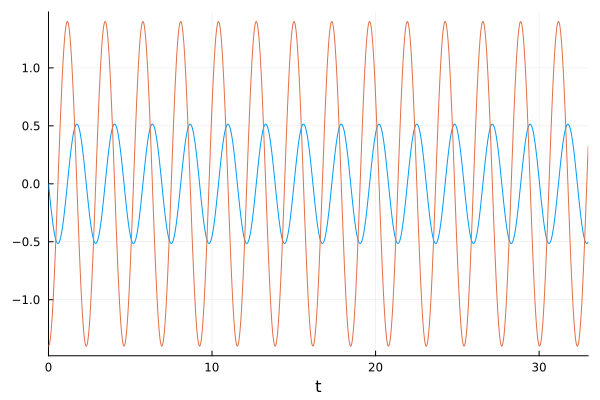
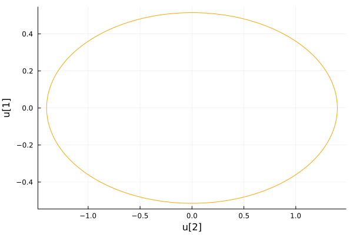
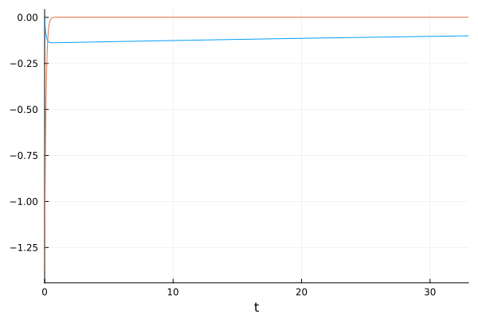
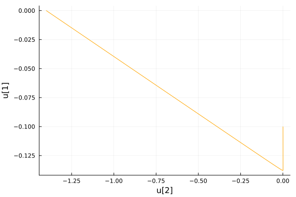
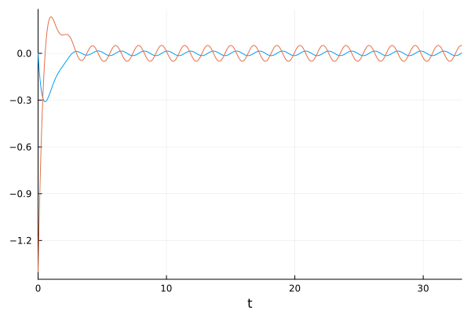
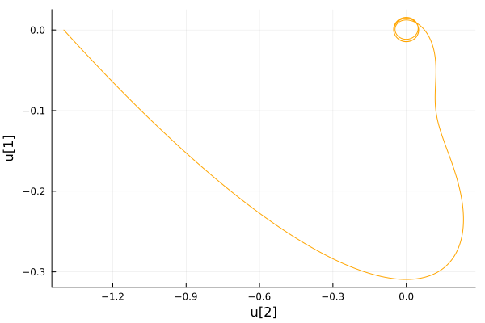

---
## Front matter
title: "Отчёт по лабораторной работе №4"
subtitle: "Модель гармонических колебаний"
author: "Гайсина Алина Ринатовна"

## Generic otions
lang: ru-RU
toc-title: "Содержание"

## Bibliography
bibliography: bib/cite.bib
csl: pandoc/csl/gost-r-7-0-5-2008-numeric.csl

## Pdf output format
toc: true # Table of contents
toc-depth: 2
lof: true # List of figures
lot: true # List of tables
fontsize: 12pt
linestretch: 1.5
papersize: a4
documentclass: scrreprt
## I18n polyglossia
polyglossia-lang:
  name: russian
  options:
	- spelling=modern
	- babelshorthands=true
polyglossia-otherlangs:
  name: english
## I18n babel
babel-lang: russian
babel-otherlangs: english
## Fonts
mainfont: PT Serif
romanfont: PT Serif
sansfont: PT Sans
monofont: PT Mono
mainfontoptions: Ligatures=TeX
romanfontoptions: Ligatures=TeX
sansfontoptions: Ligatures=TeX,Scale=MatchLowercase
monofontoptions: Scale=MatchLowercase,Scale=0.9
## Biblatex
biblatex: true
biblio-style: "gost-numeric"
biblatexoptions:
  - parentracker=true
  - backend=biber
  - hyperref=auto
  - language=auto
  - autolang=other*
  - citestyle=gost-numeric
## Pandoc-crossref LaTeX customization
figureTitle: "Рис."
tableTitle: "Таблица"
listingTitle: "Листинг"
lofTitle: "Список иллюстраций"
lotTitle: "Список таблиц"
lolTitle: "Листинги"
## Misc options
indent: true
header-includes:
  - \usepackage{indentfirst}
  - \usepackage{float} # keep figures where there are in the text
  - \floatplacement{figure}{H} # keep figures where there are in the text
---

# Цель работы
Изучение модели гармонических колебаний.

# Задание (Вариант№35)
Постройте фазовый портрет гармонического осциллятора и решение уравнения гармонического осциллятора для следующих случаев:
1. Колебания гармонического осциллятора без затуханий и без действий внешней силы $\ddot{x} + 7.4x = 0$.
2. Колебания гармонического осциллятора c затуханием и без действий внешней силы $\ddot{x} + 10.1\dot{x} + 0.1x = 0$.
3. Колебания гармонического осциллятора c затуханием и под действием внешней силы $\ddot{x} + 3\dot{x} + 3.3x = 0.2sin(3.5t)$.
На интервале $t\in [0; 33]$ (шаг 0.05) с начальными условиями $x_0 = 0, y_0 = -1.4$.

# Теоретическое введение
Движение грузика на пружинке, маятника, заряда в электрическом контуре, а также эволюция во времени многих систем в физике, химии, биологии и других науках при определенных предположениях можно описать одним и тем же дифференциальным уравнением, которое в теории колебаний выступает в качестве основной модели. Эта модель называется линейным гармоническим осциллятором. 
Уравнение свободных колебаний гармонического осциллятора имеет следующий вид: $\ddot{x} + 2\gamma\dot{x} + \omega_0^2 = 0 (1)$, где _x_ - переменная, описывающая состояние системы, $\gamma$ – параметр, характеризующий потери энергии, $\omega_0$ – собственная частота колебаний, _t_ – время.
Уравнение (1) есть линейное однородное дифференциальное уравнение второго порядка и оно является примером линейной динамической системы.
При отсутствии потерь в системе ($\gamma=0$) вместо уравнения (1) получаем уравнение консервативного осциллятора энергия колебания которого сохраняется во времени.
$$\ddot{x} + \omega_0^2 = 0 (2)$$.
Для однозначной разрешимости уравнения второго порядка (2) необходимо задать два начальных условия вида:
    $$
    \begin{cases}
        x(t_0)=x_0
        \\   
        \dot{x(t_0)}=y_0
    \end{cases}
    $$
Уравнение второго порядка (2) можно представить в виде системы двух уравнений первого порядка:
    $$
    \begin{cases}
        \dot{x}=y
        \\   
        \dot{y}=-\omega_0^2x
    \end{cases}
    $$
Начальные условия для системы примут вид:
$$
 \begin{cases}
	x(t_0)=x_0
	\\   
	y(t_0)=y_0
 \end{cases}
$$
Независимые переменные x, y определяют пространство, в котором «движется» решение. Это фазовое пространство системы, поскольку оно двумерно будем называть его фазовой плоскостью. 
Значение фазовых координат x, y в любой момент времени полностью определяет состояние системы. Решению уравнения движения как функции времени отвечает гладкая кривая в фазовой плоскости. Она называется фазовой траекторией. Если множество различных решений (соответствующих различным начальным условиям) изобразить на одной фазовой плоскости, возникает общая картина поведения системы. Такую картину, образованную набором фазовых траекторий, называют фазовым портретом.

# Выполнение лабораторной работы
## Программный код на Julia.
```
using DifferentialEquations
using Plots

# Первый случай
function syst(du, u, p, t)
    a = p
    du[1] = u[2]
    du[2] = -a*u[1]
end

u0 = [0.0, -1.4]

p = (7.4)
tspan = (0.0, 33.0)
prob = ODEProblem(syst, u0, tspan, p)
sol = solve(prob, dtmax = 0.05)

#решение системы уравнений
plot(sol, legend=:false)
savefig("4_1_1.png")

#фазовый портрет
plot(sol, vars=(2,1), legend=:false, color=:orange)
savefig("4_1_2.png")


# Второй случай
function syst(du, u, p, t)
    a, b = p
    du[1] = u[2]
    du[2] = -a*du[1] - b*u[1]
end

u0 = [0.0, -1.4]

p = (10.1, 0.1)
tspan = (0.0, 33.0)
prob = ODEProblem(syst, u0, tspan, p)
sol = solve(prob, dtmax = 0.05)

#решение системы уравнений
plot(sol, legend=:false)
savefig("4_2_1.png")

#фазовый портрет
plot(sol, vars=(2,1), legend=:false, color=:orange)
savefig("4_2_2.png")

# Третий случай
function syst(du, u, p, t)
    a, b = p
    du[1] = u[2]
    du[2] = -a*du[1] - b*u[1] + 0.2*sin(3.5*t)
end

u0 = [0.0, -1.4]

p = (3.0, 3.3)
tspan = (0.0, 33.0)
prob = ODEProblem(syst, u0, tspan, p)
sol = solve(prob, dtmax = 0.05)

#решение системы уравнений
plot(sol, legend=:false)
savefig("4_3_1.png")

#фазовый портрет
plot(sol, vars=(2,1), legend=:false, color=:orange)
savefig("4_3_2.png")
```
## Результат выполнения программы
1. Построила модель колебания гармонического осциллятора без затуханий и без действий внешней силы $\ddot{x} + 7.4x = 0$ (Рис. [-@fig:001]).
{#fig:001 width=70%}

2. Построила фазовый портрет для первого случая (Рис. [-@fig:002]).
{#fig:002 width=70%}

3. Построила модель колебания гармонического осциллятора c затуханием и без действий внешней силы $\ddot{x} + 10.1\dot{x} + 0.1x = 0$ (Рис. [-@fig:003]).
{#fig:003 width=70%}

4. Построила фазовый портрет для второго случая (Рис. [-@fig:004]).
{#fig:004 width=70%}

5. Построила модель колебания гармонического осциллятора c затуханием и под действием внешней силы $\ddot{x} + 3\dot{x} + 3.3x = 0.2sin(3.5t)$ (Рис. [-@fig:005]).
{#fig:005 width=70%}

6. Построила фазовый портрет для третьего случая (Рис. [-@fig:006]).
{#fig:006 width=70%}


# Выводы
Была изучена модель гармонических колебаний.

# Список литературы. Библиография
Документация по Julia: https://docs.julialang.org/en/v1/